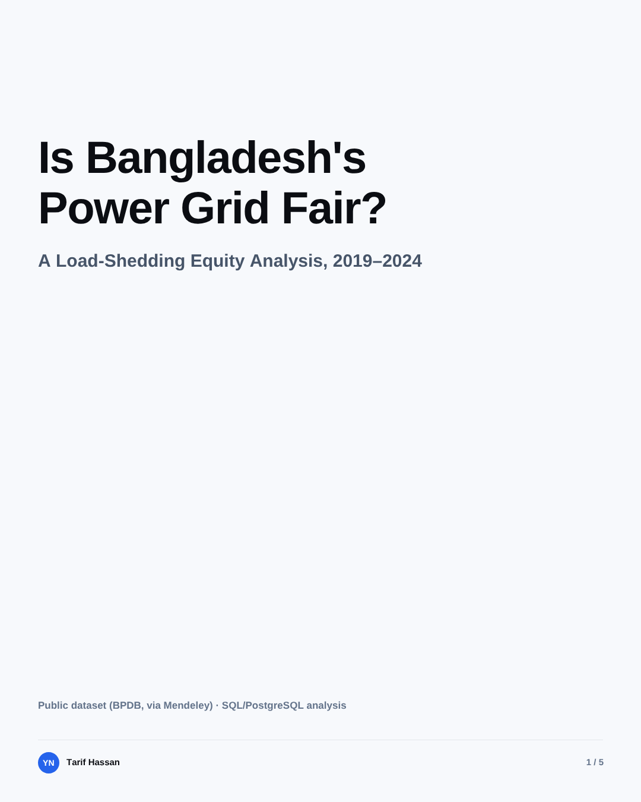
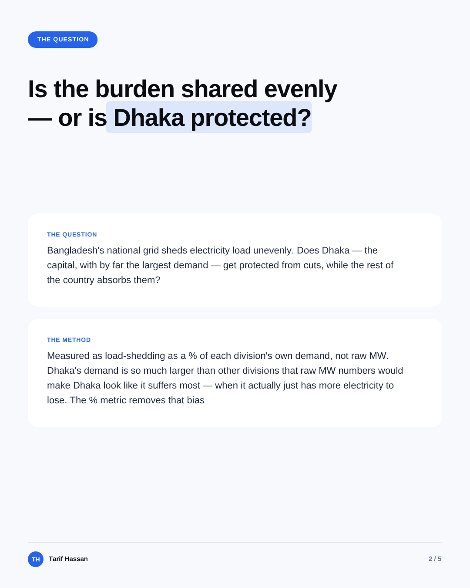
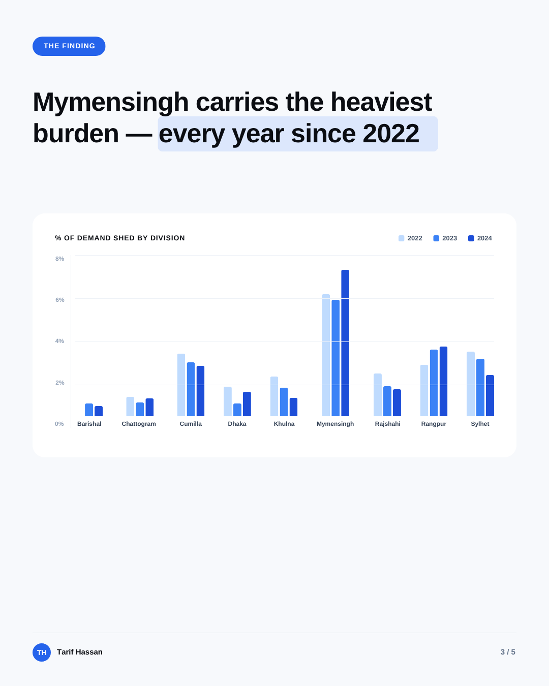
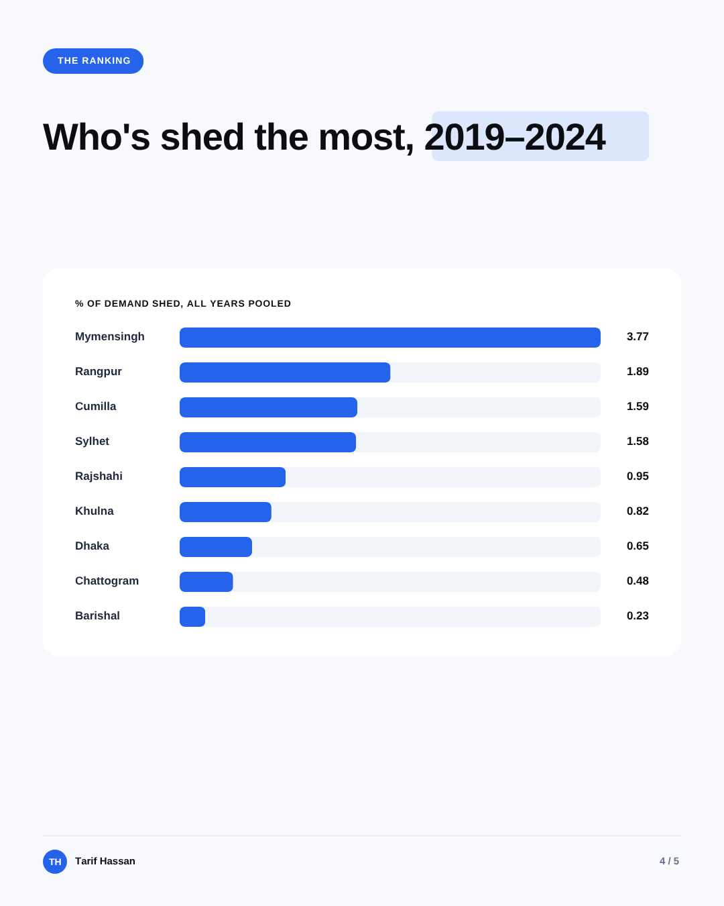
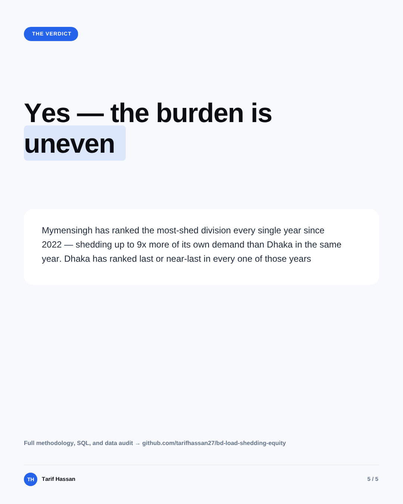

# Is Bangladesh's Power Grid Fair?
### A Load-Shedding Equity Analysis, 2019–2024

Bangladesh's national grid sheds electricity load across nine power-grid divisions. This project asks a simple question with a rigorous answer: **is that burden shared evenly, or is Dhaka — the capital, with by far the largest demand — structurally protected while the rest of the country absorbs the cuts?**

Public dataset · PostgreSQL / SQL analysis · Personal portfolio project

## Business problem

When supply falls short, someone has to absorb each cut — and how that burden is distributed across divisions is a fairness question. Raw megawatts can't answer it, because Dhaka's demand dwarfs every other division's; a fair comparison has to measure each division's shedding against its own demand. Full framing in [`01_business_problem/problem_statement.md`](01_business_problem/problem_statement.md).

## The Question & Method

Load-shedding is measured as **a percentage of each division's own demand — not raw MW**. Dhaka's demand is so much larger than every other division that raw MW comparisons would make Dhaka look like it suffers the most, when it actually just has more electricity to lose. The percentage metric removes that bias and answers the fairness question directly.

The ratio is calculated as **`SUM(load_mw) / SUM(demand_mw)`** across each division-year (a ratio-of-sums, not an average-of-daily-ratios), which weights every megawatt equally rather than letting a handful of unusual low-demand days distort the result.

## The Finding

Mymensingh has ranked the **most-shed division in the country every single year since 2022** — no exceptions. In the same years, Dhaka has ranked last or near-last. In 2023, Mymensingh shed 5.41% of its own demand while Dhaka shed just 0.58% — roughly a **9x gap in the same year**.

## The Ranking

Pooled across the full 2019–2024 period, Mymensingh sheds **3.77%** of its own demand — over 5x Dhaka's **0.65%**, and over 16x Barishal's **0.23%** (the lowest of all nine divisions). This pooled figure is diluted by the near-zero shedding years of 2019–2021; the single-year 2023 gap above is a sharper picture of the disparity during the actual crisis period.

## The Verdict

**Yes — the burden is uneven.** Mymensingh has carried a persistently disproportionate share of Bangladesh's load-shedding since the 2022 supply crisis began, while Dhaka has been consistently protected. This is a stable, structural pattern across three consecutive years, not year-to-year noise.

---

## How this was built

Everything in this repo is real, reproducible SQL work against public data — nothing here is simulated or estimated.

- **`03_sql/01_load/`** — schema creation and data loading, including a 9-branch `UNION ALL` reshape from wide to long format
- **`03_sql/02_audit/`** — a full data-quality audit (nulls, impossible values, internal consistency checks, missing-date detection) plus reconciliation queries verifying every loaded value against the raw source
- **`03_sql/03_baseline/`** — descriptive baseline: shedding by year, by month (seasonality), by division, and demand growth over time
- **`03_sql/04_equity/`** — the core equity analysis: the percentage-of-demand ratio, year-by-year rankings using `RANK() OVER (PARTITION BY ...)`, and a sanity check confirming the extreme values (Mymensingh, Barishal) are genuine, not data artifacts

**Data source:** [Structured Dataset of Daily Electricity Demand, Generation, Load Shedding, and Supply Constraints in Bangladesh (2019–2024)](https://doi.org/10.17632/x7r7wdb39k), Mendeley Data, Version 2 — 1,850 days across 9 divisions, sourced from BPDB (Bangladesh Power Development Board).

**Full presentation deck:** [`04_executive_brief/Bangladesh_Power_Grid_Equity.pdf`](04_executive_brief/Bangladesh_Power_Grid_Equity.pdf)

## Repo structure

- `01_business_problem/` — the business framing and the question
- `02_data/` — data source, table inventory, and data-quality notes (raw files excluded via `.gitignore`)
- `03_sql/` — load, audit, baseline, and equity-analysis scripts, grouped by phase
- `04_executive_brief/` — the presentation deck (PDF + individual slide images)

**Tools:** PostgreSQL 18, DBeaver, Git

---

*Tarif Hassan — [LinkedIn](https://linkedin.com/in/tarifhassan27)*
